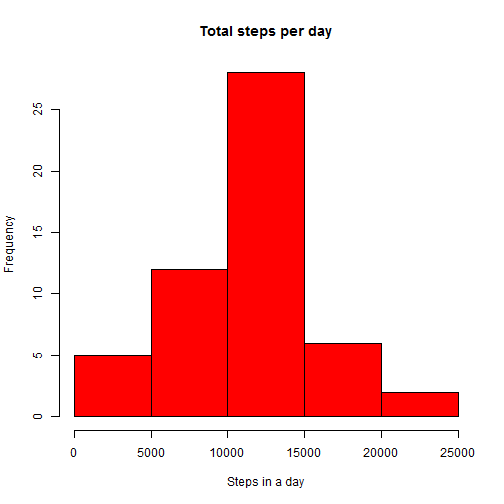
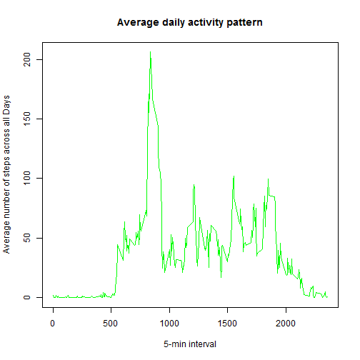

## Loading and preprocessing the data

```r
input_data <- read.csv("activity.csv",colClasses = c("numeric","character","numeric"))
head(input_data)
```

```
##   steps       date interval
## 1    NA 2012-10-01        0
## 2    NA 2012-10-01        5
## 3    NA 2012-10-01       10
## 4    NA 2012-10-01       15
## 5    NA 2012-10-01       20
## 6    NA 2012-10-01       25
```

```r
names(input_data)
```

```
## [1] "steps"    "date"     "interval"
```

```r
input_data$date <- as.Date(input_data$date, "%Y-%m-%d")
```

## What is the mean total number of steps taken per day?
Approach is to remove the records where NA, then use aggregate function to sum the steps per day.

```r
SumSteps <- aggregate(steps ~ date, data = input_data, sum, na.rm = TRUE)
head(SumSteps)
```

```
##         date steps
## 1 2012-10-02   126
## 2 2012-10-03 11352
## 3 2012-10-04 12116
## 4 2012-10-05 13294
## 5 2012-10-06 15420
## 6 2012-10-07 11015
```
Then using histogram function

```r
hist(SumSteps$steps, main = "Total steps per day", xlab = "Steps in a day", col = "red")
```

 

Calculate the mean

```r
mean(SumSteps$steps)
```

```
## [1] 10766.19
```
Calculate the median

```r
median(SumSteps$steps)
```

```
## [1] 10765
```

##What is the average daily activity pattern?
The approach is to get a average number of steps across all days excluding the NA records for each of 5-minute intervals of the dataset and then use the plot function with type=l for making a time series plot.


```r
time_series_data <- tapply(input_data$steps, input_data$interval, mean, na.rm = TRUE)
```
The plot is:

```r
plot(row.names(time_series_data), time_series_data, type = "l", xlab = "5-min interval", 
    ylab = "Average number of steps across all Days", main = "Average daily activity pattern", 
    col = "green")
```

 

Which 5-minute interval, on average across all the days in the dataset, contains the maximum number of steps?

```r
max_interval <- which.max(time_series_data)
max_interval
```

```
## 835 
## 104
```

```r
names(max_interval)
```

```
## [1] "835"
```

##Imputing missing values

```r
input_data_NA <- is.na(input_data)
head(input_data_NA)
```

```
##      steps  date interval
## [1,]  TRUE FALSE    FALSE
## [2,]  TRUE FALSE    FALSE
## [3,]  TRUE FALSE    FALSE
## [4,]  TRUE FALSE    FALSE
## [5,]  TRUE FALSE    FALSE
## [6,]  TRUE FALSE    FALSE
```

```r
total_NA_count <- sum(input_data_NA)
total_NA_count
```

```
## [1] 2304
```

Devise a strategy for filling in all of the missing values in the dataset. The strategy does not need to be sophisticated. For example, you could use the mean/median for that day, or the mean for that 5-minute interval,etc

Fist Na replaced by mean in 5 min interval

```r
averages <- aggregate(x=list(steps=input_data$steps), by=list(interval=input_data$interval),
                      FUN=mean, na.rm=TRUE)
head(averages)
```

```
##   interval     steps
## 1        0 1.7169811
## 2        5 0.3396226
## 3       10 0.1320755
## 4       15 0.1509434
## 5       20 0.0754717
## 6       25 2.0943396
```

```r
fill.value <- function(steps, interval) {
    filled <- NA
    if (!is.na(steps))
        filled <- c(steps)
    else
        filled <- (averages[averages$interval==interval, "steps"])
    return(filled)
}
filled.data <- input_data
filled.data$steps <- mapply(fill.value, filled.data$steps, filled.data$interval)
```
Make a histogram of the total number of steps taken each day and Calculate and report the mean and median total number of steps taken per day. Do these values differ from the estimates from the first part of the assignment? What is the impact of imputing missing data on the estimates of the total daily number of steps?

```r
SumSteps2 <- aggregate(steps ~ date, data = filled.data, sum, na.rm = TRUE)
head(SumSteps2)
```

```
##         date    steps
## 1 2012-10-01 10766.19
## 2 2012-10-02   126.00
## 3 2012-10-03 11352.00
## 4 2012-10-04 12116.00
## 5 2012-10-05 13294.00
## 6 2012-10-06 15420.00
```
Then using histogram function

```r
hist(SumSteps2$steps, main = "Total steps per day", xlab = "Steps in a day", col = "blue")
```

 
Calcuate the mean and median

```r
mean(SumSteps2$steps)
```

```
## [1] 10766.19
```

```r
median(SumSteps2$steps)
```

```
## [1] 10766.19
```
The mean is the same as the first scenario with NA's. This is expected as we added the mean of the interval to the missing values. But the median is increased as we have plugged the missing values.

##Are there differences in activity patterns between weekdays and weekends?
For this part the weekdays() function may be of some help here. Use the dataset with the filled-in missing values for this part.
Now to calcuate the Weekday or Weekend..

```r
day <- weekdays(filled.data$date)
daylevel <- vector()
for (i in 1:nrow(filled.data)) {
    if (day[i] == "Saturday") {
        daylevel[i] <- "Weekend"
    } else if (day[i] == "Sunday") {
        daylevel[i] <- "Weekend"
    } else {
        daylevel[i] <- "Weekday"
    }
}
filled.data$daylevel <- daylevel
filled.data$daylevel <- factor(filled.data$daylevel)

stepsByDay <- aggregate(steps ~ interval + daylevel, data = filled.data, mean)
names(stepsByDay) <- c("interval", "daylevel", "steps")
```

Make a panel plot containing a time series plot (i.e. type = "l") of the 5-minute interval (x-axis) and the average number of steps taken, averaged across all weekday days or weekend days (y-axis). The plot should look something like the following, which was creating using simulated data:


```r
library(lattice)
xyplot(steps ~ interval | daylevel, stepsByDay, type = "l", layout = c(1, 2), 
    xlab = "Interval", ylab = "Number of steps")
```

 
